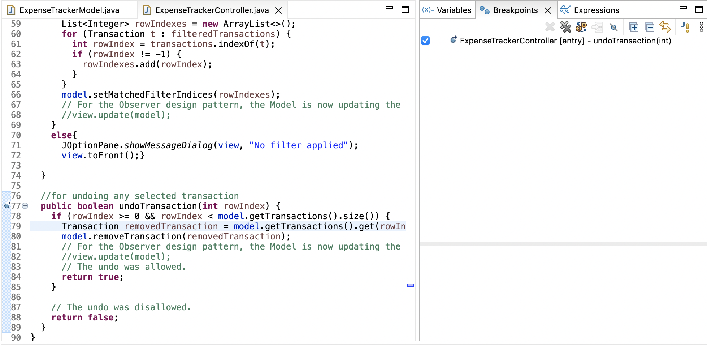

# hw4-solution

Covers the following topics:
- Test driven development
- Observer design pattern
- Regression testing
- Using a Java IDE to document, compile, test and debug

Here are the 5 debugging screenshots

Screenshot 1: API view // See the outline view (top right corner) and the javadoc view (bottom)

Screenshot 2: Test runner view with all test cases passing

Screenshot 3: Debugger breakpoint view // See the source view has the breakpoint toggled on (blue dot) and the breakpoints view (top right corner)

Screenshot 4: Debugger variables view after add transaction // Model contains the single added transaction. Alternatively View (Heap allocated Swing UI widgets) contains the single added transition.

Screenshot 5: Debugger variables view after undo transaction // Model contains no transactions. Alternatively View (Heap allocated Swing UI widgets) contains no transactions.

